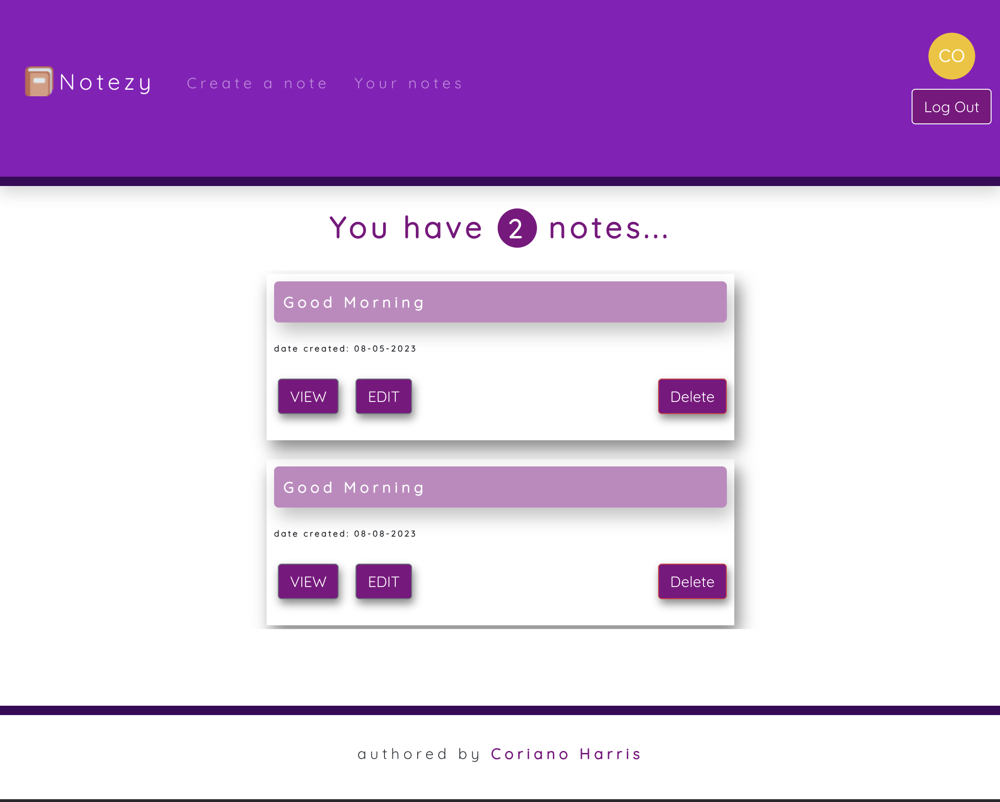
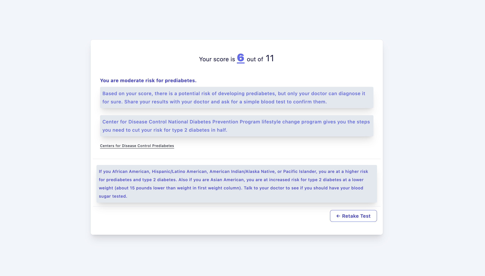

# Who am I? 

Well, hello Githubers! I've had some wicked awesome experiences working with incredible organizations and communities, making a real impact along the way.

Settle in with a bowl of popcorn because I have an exciting tech story to share from my time one of my employers. Imagine a scene where users were anxiously fidgeting in their seats, struggling to keep up with their troublesome product payments. It resembled a group of kittens trying to juggle balls of yarn!

But fear not, for I emerged as their tech superhero! With user observations and a team of UI researchers (minus the Sherlock Holmes pipe), we dove deep into the abyss of this problem. With tears of empathy (okay, maybe I'm being a tad dramatic), I created a magical alert component. It swooped in like a superhero sidekick, reminding users of their current, upcoming, or past-due payments. It was like having a personal finance assistant, without the boring suits and stern looks! Who wouldn't be thrilled to have their financial life under control? It was a win-win situation, and I felt like the coolest tech hero in town.

So, there you have it. With a dash of empathy, a sprinkle of code, a love for users, and a pinch of humor, I helped these folks conquer their payment woes and set them on the path to ultimate success. Cheers to making the tech world a better place, one payment alert at a time!

To checkout some of my fun and hair pulling projects, head over to [my website](https://www.corianoharris.com)  

  <a href="https://www.corianoharris.com/" target="_blank">
     &message=WEBSITE&color=6495ED&style=plastic&logo-color=white"/>
  </a>
  <a href="https://www.corianoharris.com/public/documents/resume.pdf" target="_blank">
     &message=RESUME&color=6495ED&style=plastic&logo-color=white"/>
  </a>
  <a href="https://www.linkedin.com/in/corianoharris/" target="_blank">
       &message=LINKEDIN&color=6495ED&style=plastic&logo-color=white"/>
  </a>

 
<h1 align="center"> Giving back to the community!</h1>
 

  

 
<h1 align="center">Projects</h1>
<table bordercolor="#66b2b2">
  
  <tr>
    <td width="50%" valign="top">
      <h3 align="center">Notezy</h3>
         
        
         
        

          
    
  
      

        
<strong>React, Airtable, Bootstrap, Auth0, JavaScript </strong> - Platform for users to write and archive their notes.

    </td>
    <td width="50%" valign="top">
      <h3 align="center">Prediabetes Risk Test</h3>
         
      
         
        

          
  
   
      

        
<strong>Next.js, TypeScript, Tailwind </strong> - Platform for users to check their prediabetes risk.

    </td>
  </tr>
</table>
 
<h1 align="center">Technologies</h1>

    
    
    
    
    
    
    
    
    
    
    
    
    
    
    
    
    
    
    

 
<h1 align="center">Github Stats</h1>

    

    

